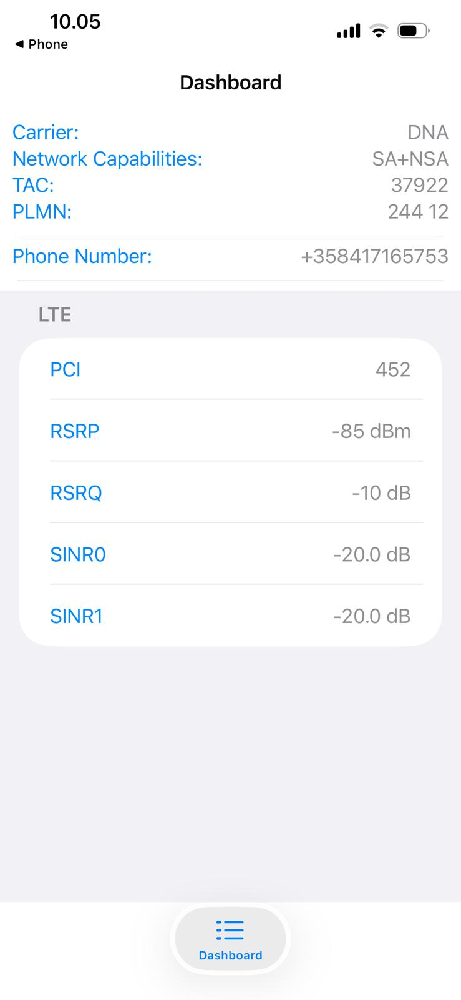
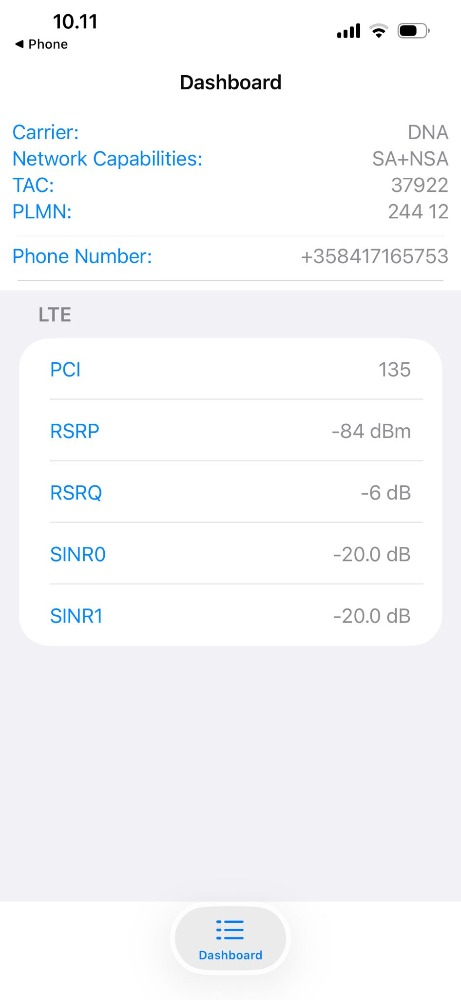

# Exercise 3.1: Investigating Cellular Network Parameters Using Service Mode

---

## Objective
The objective of this experiment is to explore and analyze key cellular network parameters using smartphone service mode (Field Test Mode). The experiment focuses on understanding how signal strength and signal quality vary under different conditions and how these variations affect network performance, stability, and connectivity reliability.

---

## Device and Tools Used
- **Device:** Apple iPhone  
- **Operating System:** iOS  
- **Network Operator:** DNA (Finland)  
- **Service Mode:** iOS Field Test Mode  
- **Access Method:** Dialing `*3001#12345#*`  

Apple iOS does not provide a traditional Android-style service menu. Instead, Field Test Mode was used to access real-time cellular network parameters.

---

## Experiment Setup and Test Conditions
Measurements were taken while the device was connected to the LTE (4G) network. Two different measurements were recorded at different moments and/or positions to observe changes in network behavior.

Test conditions included:
- Indoor environment
- Slight movement resulting in cell reselection

---

## Parameters Observed
The following cellular network parameters were collected from Field Test Mode:

- **RSRP (Reference Signal Received Power)** – Signal strength  
- **RSRQ (Reference Signal Received Quality)** – Signal quality  
- **SINR (Signal-to-Interference-and-Noise Ratio)** – Interference level  
- **PCI (Physical Cell ID)** – Serving cell identifier  
- **Network Technology** – LTE (4G)

---

## Measurement Data
  
  ### Field Test Mode Screenshots

**Measurement 1**

**Measurement 2**

| Parameter | Measurement 1 | Measurement 2 |
|--------|--------------|--------------|
| Network Type | LTE | LTE |
| PCI | 452 | 135 |
| RSRP | −85 dBm | −84 dBm |
| RSRQ | −10 dB | −6 dB |
| SINR | −20 dB | −20 dB |

Screenshots from iOS Field Test Mode were recorded and stored in the repository as supporting evidence.

---

## Analysis and Observations

### Signal Strength (RSRP)
Both measurements show RSRP values around −85 dBm, which indicates **good signal strength**. This suggests that the device was receiving sufficient power from the serving base station and was not at the edge of coverage.

### Signal Quality (RSRQ and SINR)
Although signal strength was good, signal quality varied:
- RSRQ improved from −10 dB to −6 dB, indicating better channel conditions or reduced congestion.
- SINR remained very low at −20 dB in both cases, indicating **high interference and noise**.

This shows that strong signal strength does not necessarily guarantee good signal quality or high data performance.

### Cell ID Change
The Physical Cell ID changed from 452 to 135, indicating **cell reselection or handover**. This may occur due to user movement or changing radio conditions.

Despite the cell change, SINR did not improve, suggesting persistent interference in the surrounding environment.

---

## Impact on Network Performance
Based on the observed parameters:
- **Data speed:** Likely reduced due to very low SINR  
- **Network stability:** Maintained due to good RSRP  
- **Connectivity reliability:** Stable connection, but possible throughput fluctuations  

This highlights the importance of signal quality parameters over signal strength alone.

---

## Factors Affecting the Measurements
The following factors may have influenced the results:
- Distance from the serving cell tower  
- Indoor environment and building materials  
- Interference from neighboring LTE cells  
- Network load and environmental conditions  

---

## Conclusions
This experiment demonstrates that good signal strength does not always result in good network performance. While RSRP values indicated strong reception, very low SINR values revealed high interference, which can negatively affect data speed and quality.

The experiment emphasizes the importance of analyzing both signal strength and signal quality when evaluating cellular network performance.

---
