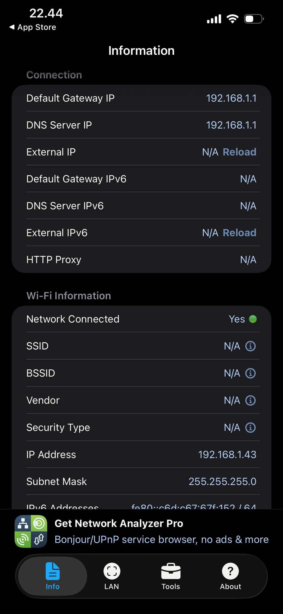

# Exercise 3.2: Analyzing Network Infrastructure with NET Analyzer

## Objective
The objective of this experiment is to analyze a local Wi-Fi network using the NET Analyzer mobile application. The analysis focuses on understanding the network’s configuration, performance, and potential issues related to signal strength, latency, congestion, and infrastructure setup.

---

## Device and Tools Used
- **Device:** Apple iPhone  
- **Operating System:** iOS  
- **Application:** NET Analyzer (iOS)  
- **Network Type:** Local Wi-Fi network  

---

## Measurement Setup
The measurements were conducted while the device was connected to a local Wi-Fi network. NET Analyzer was used to collect IP-level and network infrastructure information.

Measurements were taken from a fixed indoor location.

---

## Network Information Collected

### IP and Gateway Details
- **Device IP Address:** 192.168.1.43  
- **Subnet Mask:** 255.255.255.0  
- **Default Gateway IP:** 192.168.1.1  
- **DNS Server IP:** 192.168.1.1  
- **External IP:** Not available  
- **IPv6:** Not available  

These values indicate a standard private IPv4 home network configuration using a single router acting as both gateway and DNS server.

---

## Wi-Fi Network Details
- **Network Connected:** Yes  
- **SSID:** Not available (restricted by iOS permissions)  
- **BSSID:** Not available  
- **Vendor:** Not available  
- **Security Type:** Not displayed  

Due to iOS privacy and permission limitations, certain Wi-Fi parameters such as SSID, BSSID, and security type were not visible in the application.

---

## Screenshots

### NET Analyzer – Network Information

The screenshot above was captured directly from the NET Analyzer application and used as evidence for the recorded measurements.

---

## Analysis and Troubleshooting

### Network Performance Observations
- The device successfully obtained a private IP address, confirming correct DHCP operation.
- Using the same IP address for gateway and DNS suggests centralized routing and name resolution.
- Absence of IPv6 indicates the network relies solely on IPv4 connectivity.

### Potential Issues Identified
- Limited visibility of wireless-layer parameters (SSID, BSSID, security)  
- Possible inability to analyze channel overlap or interference  
- Lack of IPv6 support  

---

## Practical Recommendations

To improve network performance and analysis capability, the following actions are recommended:

- Enable full application permissions if supported by iOS  
- Use channel analysis to detect interference from nearby Wi-Fi networks  
- Reposition the router to improve coverage  
- Switch to less congested Wi-Fi channels  
- Enable dual-band operation (2.4 GHz and 5 GHz) if supported  
- Consider enabling IPv6 for modern network compatibility  

---

## Conclusion
This experiment demonstrated the use of NET Analyzer for analyzing a local Wi-Fi network’s infrastructure. While essential IP-level parameters were successfully identified, deeper wireless analysis was limited by operating system restrictions. The experiment highlights the importance of proper router configuration, channel planning, and diagnostic tools for effective network management.

---
