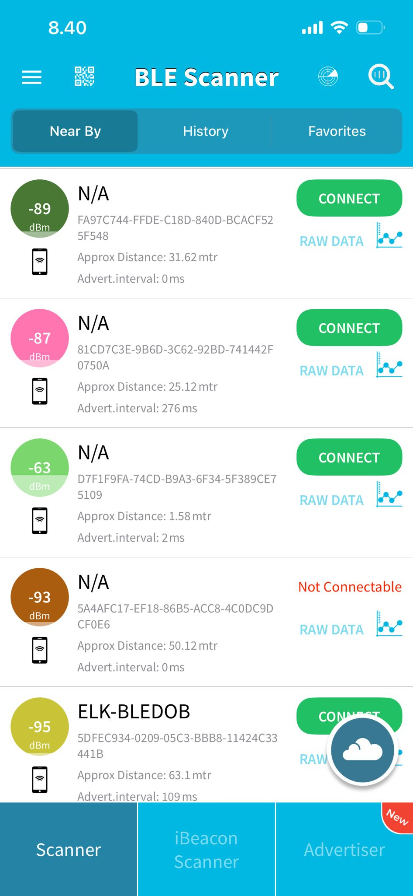
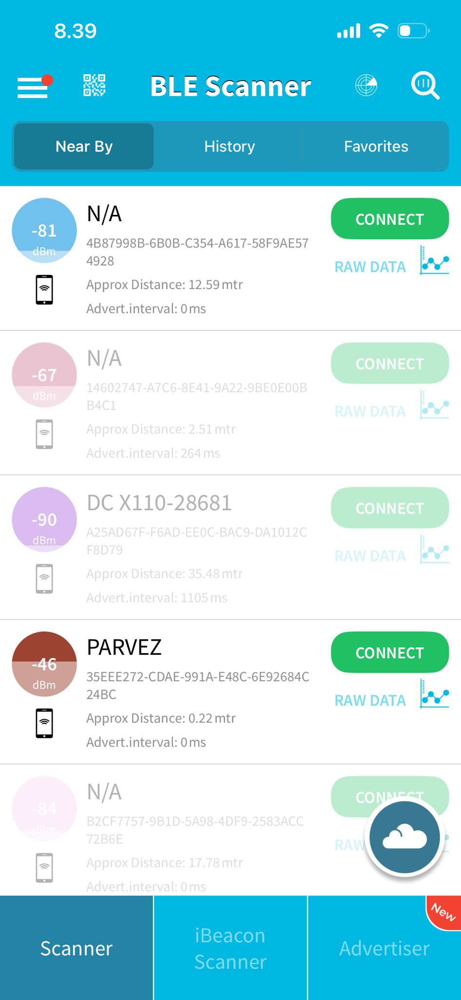
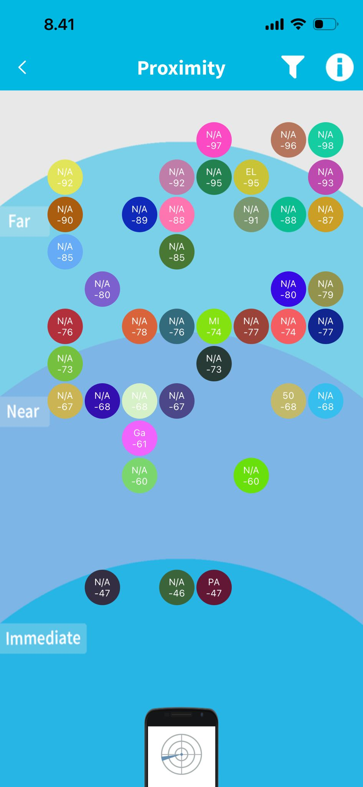
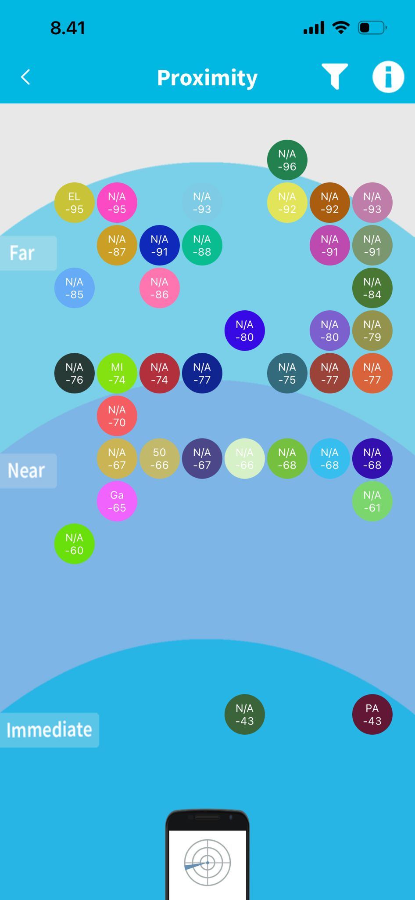

# Exercise 3.3  
## Exploring Bluetooth Low Energy (BLE) Networks with BLE Scanner

### Objective
The objective of this experiment is to investigate nearby Bluetooth Low Energy (BLE) devices and analyze how detected devices and signal characteristics vary in different environments.

---

## Tools Used
- **BLE Scanner mobile application** (iOS)
- Smartphone with Bluetooth enabled

---

## Scanning Environments and Setup

Two different environments were selected for BLE scanning:

1) **Inside Room**
   - Closed indoor environment
   - Presence of walls, furniture, and human activity

2) **Outside Room**
   - Open corridor / outdoor-adjacent space
   - Fewer physical obstructions

For each environment:
- A **device list scan** was recorded
- A **proximity map view** was recorded

Screenshots are included below.

---

## Collected Data

### 📍 Inside Room — Device List Scan

| Device Name | MAC / Identifier | RSSI (dBm) | Approx. Distance |
|-------------|------------------|------------|------------------|
| N/A | FA97C744-FFDE-C18D-840D-BCACF525F548 | -89 | 31.62 m |
| N/A | 81CD7C3E-9B6D-3C62-92BD-741442F0750A | -87 | 25.12 m |
| N/A | D7F1F9FA-74CD-B9A3-6F34-5F389CE75109 | -63 | 1.58 m |
| N/A | 5A4AFC17-EF18-86B5-ACC8-4C0DC9DCF0E6 | -93 | 50.12 m |
| ELK-BLEDOB | 5DFEC934-0209-05C3-BBB8-11424C33441B | -95 | 63.1 m |

**Total devices detected:** 5

---

### 📍 Outside Room — Device List Scan

| Device Name | MAC / Identifier | RSSI (dBm) | Approx. Distance |
|-------------|------------------|------------|------------------|
| N/A | 4B87998B-6B0B-C354-A617-58F9AE574928 | -81 | 12.59 m |
| N/A | 14602747-A7C6-8E41-9A22-9BE0E00BB4C1 | -67 | 2.51 m |
| DC X110-28681 | A25AD67F-F6AD-EE0C-BAC9-DA1012CF8D79 | -90 | 35.48 m |
| PARVEZ | 35EEE272-CDAE-991A-E48C-6E92684C24BC | -46 | 0.22 m |
| N/A | B2CF7757-9B1D-5A98-4DF9-2583ACC72B6E | -84 | 17.78 m |

**Total devices detected:** 5

---

## Proximity Map Views

### 📍 Inside Room — Proximity View

### 📍 Outside Room — Proximity View

The proximity maps classify detected devices into **Immediate**, **Near**, and **Far** zones based on RSSI strength.

---

## Analysis and Interpretation

### RSSI vs Distance Relationship

RSSI becomes more negative as distance increases.

Examples from scans:

- **-46 dBm → 0.22 m** (Very close device — strong signal)
- **-63 dBm → 1.58 m** (Strong indoor signal)
- **-81 to -89 dBm → 12–31 m** (Moderate distance)
- **-93 to -95 dBm → 50–63 m** (Far or obstructed devices)

This confirms the expected inverse relationship between RSSI and distance.

---

### Comparison Between Environments

| Feature | Inside Room | Outside Room |
|--------|-------------|--------------|
| Total devices detected | 5 | 5 |
| Strongest RSSI | -63 dBm | -46 dBm |
| Weakest RSSI | -95 dBm | -90 dBm |
| Closest device distance | 1.58 m | 0.22 m |
| Farthest device distance | 63.1 m | 35.48 m |

**Observations:**

- Outside room scan shows stronger signals for close devices due to fewer obstructions.
- Inside room signals are more attenuated because walls and furniture block propagation.
- Proximity maps show more devices classified as **Far** indoors.
- Open space reduces multipath interference and signal reflection.

---

### Physical and Environmental Effects

- **Walls and furniture** inside the room weaken signals.
- **Human movement** causes signal fluctuation.
- **Open outdoor space** allows stronger direct line-of-sight transmission.
- **Transmission power differences** between devices also affect detection range.

---

## Security and Privacy Considerations

BLE is widely used in:
- Smartwatches and fitness bands
- Wireless earbuds
- IoT sensors and smart home devices
- Beacons in malls and airports

### Potential Risks

- **Device tracking:** Static MAC addresses allow tracking of user movement.
- **Identifier exposure:** Device names and IDs can reveal personal information.
- **Passive scanning:** Anyone can detect broadcasting BLE devices without user consent.

### Mitigation Methods

- MAC address randomization
- Encrypted BLE communication
- Limiting advertisement data exposure

These measures reduce privacy and tracking risks in modern BLE systems.

---

## Final Conclusions

This experiment successfully demonstrated how BLE device detection and signal strength vary across environments. Indoor scans showed greater signal attenuation due to physical obstructions, while outdoor scans displayed stronger and more stable RSSI values. The proximity view visually confirmed immediate, near, and far classifications based on signal strength. Additionally, the experiment highlighted important security and privacy concerns regarding passive BLE scanning and device tracking. Overall, BLE scanning provides valuable insight into wireless device behavior in real-world environments.

---

