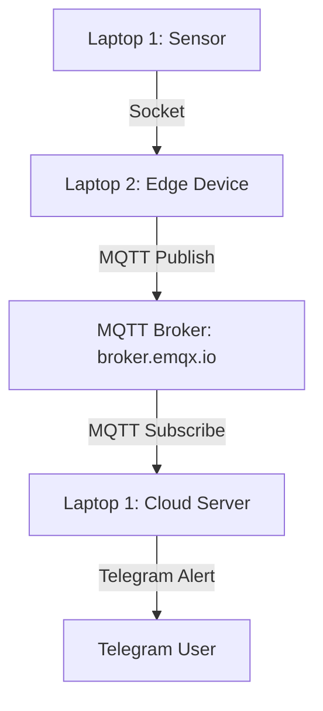

# Lab 4: MQTT Alert System with Telegram

## Student Submission
**Course:** Wireless and Radiotechnology IT23SP  
**Instructor:** Torunoglu  
**Year:** 2025  

---

## Objective
This lab extends the earlier hybrid IoT pipeline by adding a real-time alert system. When the cloud server receives a temperature value above a defined threshold, it sends a Telegram notification. This simulates a cloud monitoring and alert service in an IoT environment.

---

## System Architecture Diagram

### ASCII Diagram
```text
Sensor (Laptop 1)
      |
      | Socket
      v
Edge Device (Laptop 2)
      |
      | MQTT Publish
      v
MQTT Broker (broker.emqx.io)
      |
      | MQTT Subscribe
      v
Cloud Server (Laptop 1)
      |
      v
Telegram Alert
```

### Mermaid Diagram


---

## Files Included
- `mqtt_alert_subscriber.py`
- `edge_device.py`
- `socket_sensor.py`
- `requirements.txt`
- `README.md`

---

## MQTT Topic Used
```text
savonia/iot/temperature
```

---

## Threshold Used
```text
28.0 °C
```

---

## How the System Works
1. The sensor program on **Laptop 1** generates random temperature values.
2. The sensor sends each value to **Laptop 2** using TCP socket communication.
3. **Laptop 2** acts as the edge device and receives the value.
4. The edge device publishes the same value to the MQTT broker.
5. The cloud server on **Laptop 1** subscribes to the MQTT topic.
6. When the received temperature is higher than the threshold, the cloud server sends a Telegram alert.

---

## Setup Instructions

### 1. Install dependencies
```bash
pip install -r requirements.txt
```

### 2. Configure the sensor IP address
Open `socket_sensor.py` and replace:
```python
SERVER_IP = "192.168.x.x"
```
with the real IP address of **Laptop 2**.

Example:
```python
SERVER_IP = "192.168.1.20"
```

### 3. Configure Telegram credentials
Open `mqtt_alert_subscriber.py` and replace:
```python
TOKEN = "YOUR_TELEGRAM_BOT_TOKEN"
CHAT_ID = "YOUR_CHAT_ID"
```
with your real Telegram bot token and chat ID.

---

## How to Create the Telegram Bot
1. Open **Telegram**.
2. Search for **BotFather**.
3. Create a new bot using:
```text
/newbot
```
4. BotFather will give you a **bot token**.
5. Send any message to your new bot.
6. Open this in your browser:
```text
https://api.telegram.org/botYOUR_TOKEN/getUpdates
```
7. Find your **chat ID** from the response.

---

## Run the System
Start the programs in this order:

### Laptop 1 — Cloud Alert Subscriber
```bash
python mqtt_alert_subscriber.py
```

### Laptop 2 — Edge Device
```bash
python edge_device.py
```

### Laptop 1 — Sensor
```bash
python socket_sensor.py
```

---

## Expected Terminal Output

### Cloud Server Terminal
```text
Subscribed to topic: savonia/iot/temperature
Alert threshold: 28.0 °C
Temperature: 26.5
Temperature: 29.3
ALERT: High temperature 29.3 °C
```

### Edge Device Terminal
```text
Edge device waiting for sensor...
Sensor connected: ('192.168.x.x', 54321)
Edge received: 29.3
Forwarded to MQTT: 29.3
```

### Sensor Terminal
```text
Connected to edge device at 192.168.x.x:5000
Sensor value sent: 26.5
Sensor value sent: 29.3
```

---

## Screenshot of Telegram Alert
Add your real Telegram screenshot here before submission.

```text
[Insert screenshot showing the Telegram alert message received from the bot]
```

---

## Reflection Question
### Why is MQTT useful for building monitoring and alert systems in IoT?
MQTT is useful for monitoring and alert systems in IoT because it is lightweight, fast, and efficient for sending small sensor messages between devices. It uses the publish/subscribe model, which allows many devices and services to communicate without being directly connected to each other. This makes it easy for sensors, edge devices, cloud servers, and alert services to work together in real time. MQTT also reduces network overhead, which is important in IoT environments where devices may have limited power, bandwidth, or processing capability.

---

## Repository Structure
```text
lab4-mqtt-alert-system/
│── mqtt_alert_subscriber.py
│── edge_device.py
│── socket_sensor.py
│── requirements.txt
└── README.md
```

---

## Notes
- Both laptops should be on the same local network for socket communication.
- `broker.emqx.io` is a public broker and may occasionally be slow or busy.
- Replace placeholder values before submission.
- Add your real Telegram screenshot to the README or repository.

---

## Conclusion
This lab demonstrates a complete monitoring pipeline from sensor to edge to cloud with a real-time Telegram alert. It combines socket programming, MQTT messaging, and Telegram API integration to simulate a practical IoT alert system.
