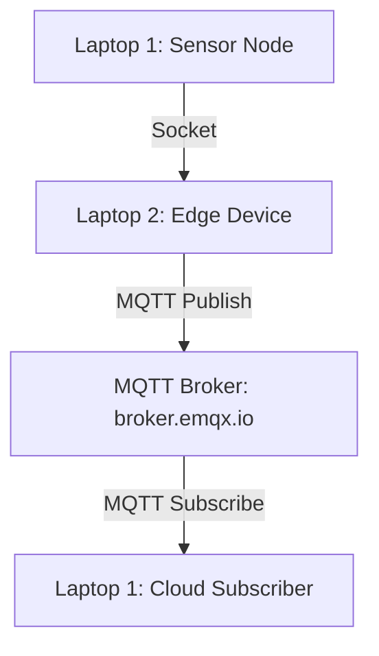

# Hybrid IoT Communication Lab: Sockets + MQTT

## Student Submission
**Course:** Wireless and Radiotechnology IT23SP  
**Lab Series:** From Sockets to MQTT in IoT Systems  
**Instructor:** Torunoglu  
**Year:** 2025  

---

## Objective
This lab series demonstrates a simple IoT communication pipeline using **two laptops** and two communication methods:

- **Socket Programming** for direct local communication
- **MQTT Messaging** for cloud/server communication

The system simulates:
- a **sensor node**
- an **edge device**
- a **cloud/server subscriber**

---

## System Architecture

### ASCII Diagram
```text
Laptop 1 (Sensor Node)
        |
        | Socket Programming
        v
Laptop 2 (Edge Device)
        |
        | MQTT Publish
        v
MQTT Broker (broker.emqx.io)
        |
        | MQTT Subscribe
        v
Laptop 1 (Cloud / Main Server)
```

### Mermaid Diagram


---

## Files Included
- `socket_server.py`
- `socket_sensor.py`
- `mqtt_publisher.py`
- `mqtt_subscriber.py`
- `edge_device.py`
- `requirements.txt`
- `README.md`

---

## Technologies Used
- Python 3
- Socket Programming (`socket` library)
- MQTT (`paho-mqtt` library)
- Public MQTT broker: `broker.emqx.io`

---

## MQTT Topic Used
```text
savonia/iot/temperature
```

---

## IP Addresses Used
> Replace the placeholders below with your actual laptop IP addresses before submission.

- **Laptop 1 (Sensor / Subscriber):** `192.168.x.x`
- **Laptop 2 (Edge Device / Socket Server):** `192.168.x.x`

In `socket_sensor.py`, set:
```python
SERVER_IP = "192.168.x.x"
```
Replace it with the IP address of **Laptop 2**.

---

## Setup Instructions

### 1. Install Python dependency
```bash
pip install -r requirements.txt
```

### 2. Lab 1 — Socket Communication
**On Laptop 2 (Edge / Socket Server):**
```bash
python socket_server.py
```

**On Laptop 1 (Sensor Client):**
```bash
python socket_sensor.py
```

### Expected Output
**Laptop 1**
```text
Sensor value sent: 23.40
Sensor value sent: 24.10
```

**Laptop 2**
```text
Sensor data: 23.40
Sensor data: 24.10
```

---

## Lab 2 — MQTT Communication
**On Laptop 1 (Cloud Subscriber):**
```bash
python mqtt_subscriber.py
```

**On Laptop 2 (MQTT Publisher):**
```bash
python mqtt_publisher.py
```

### Expected Output
**Laptop 2**
```text
Published to MQTT: 24.10
Published to MQTT: 23.70
```

**Laptop 1**
```text
Cloud received: 24.10
Cloud received: 23.70
```

---

## Lab 3 — Full IoT Pipeline Integration
In this lab, the edge device receives sensor data over **socket** and forwards the same value to the **MQTT broker**.

### Run order
**On Laptop 1 (Cloud Subscriber):**
```bash
python mqtt_subscriber.py
```

**On Laptop 2 (Edge Device):**
```bash
python edge_device.py
```

**On Laptop 1 (Sensor Node):**
```bash
python socket_sensor.py
```

### Expected Final Output
**Laptop 2 (Edge Device)**
```text
Edge received: 23.50
Forwarded to MQTT: 23.50
Edge received: 24.20
Forwarded to MQTT: 24.20
```

**Laptop 1 (Cloud Subscriber)**
```text
Cloud received: 23.50
Cloud received: 24.20
```

---

## Submission Evidence

### 1. Screenshot of Socket Communication
Add your screenshot here after running **Lab 1**.

```text
[Insert screenshot of Laptop 1 sending socket data and Laptop 2 receiving it]
```

### 2. Screenshot of MQTT Messages
Add your screenshot here after running **Lab 2** or **Lab 3**.

```text
[Insert screenshot of MQTT publish/subscribe messages]
```

---

## Explanation of the IoT Workflow
1. The **sensor node** on Laptop 1 generates a temperature value.
2. It sends the value to Laptop 2 using **TCP socket programming**.
3. Laptop 2 acts as the **edge device**.
4. The edge device forwards the received value to the MQTT broker using **publish**.
5. Laptop 1 also runs a **subscriber** that receives the forwarded value from the broker.
6. This simulates a real IoT pipeline from **sensor → edge → cloud**.

---

## Learning Outcomes Achieved
After completing these labs, the following learning outcomes are demonstrated:

- understanding of **socket-based device communication**
- understanding of **MQTT publish/subscribe messaging**
- understanding of **edge computing concepts**
- understanding of **basic IoT system architecture**

---

## Repository Structure
```text
hybrid-iot-lab/
│── socket_server.py
│── socket_sensor.py
│── mqtt_publisher.py
│── mqtt_subscriber.py
│── edge_device.py
│── requirements.txt
└── README.md
```

---

## Notes
- Make sure both laptops are connected to the **same network** for socket communication.
- Replace the placeholder IP in `socket_sensor.py` with the real IP address of Laptop 2.
- The public broker `broker.emqx.io` may sometimes be busy; if needed, reconnect and test again.
- For the final GitHub submission, add your **real IP addresses** and **real screenshots**.

---

## Conclusion
This lab successfully builds a small hybrid IoT communication system. The solution first uses **socket programming** for direct local device-to-device communication and then uses **MQTT** to forward data to a cloud-style subscriber. The completed system demonstrates how sensor nodes, edge devices, and cloud applications interact in a practical IoT architecture.
